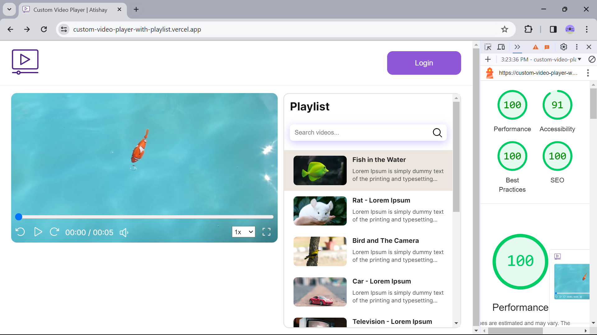

# Custom-Video-Player-with-Playlist <a href="https://custom-video-player-with-playlist.vercel.app" target="_blank">Live Link</a>
Web app for video playback, playlist management, &amp; customization. Features fullscreen, seek functionality, volume control, speed control, Autoplay, thumbnails, search, &amp; resume playback. Built with Next.js. Supports playlist reordering.

### Features:
- Video playback with support for common controls (play, pause, seek, timer, speed selector).
- Autoplay feature to transition to the next video after playback completion.
- Playlist re-ordering functionality.
- Thumbnail previews for videos in the playlist.
- Fullscreen mode.
- Volume control with dynamic icons based on the volume range.
- Search and filter functionality to find videos in the playlist.
- Keyboard shortcuts (e.g., spacebar for play/pause, left/right arrow keys for seeking, f for fullscreen).
- User preferences stored in local storage, including playback position for resume playback and selected volume.
- Responsive acrross various screens

### Lighthouse Report:

### Technologies Used:
- Next.js
- React.js
- HTML5
- CSS
- JavaScript

### How to Run Locally:

1. Clone the repository to your local machine: git clone https://github.com/At1902/Custom-Video-Player-with-Playlist.git
2. Navigate to the project directory: cd custom-video-player-with-playlist
3. Install dependencies: Run 'npm install'
4. Start the development server: Run 'npm run dev'
5. Open your browser and navigate to http://localhost:3000 to view the application.
6. Format the files: Run 'npm run format' to prettify all files and ensure consistent code formatting across the project in one go.

### Project Structure:

  #### Top-level Folders:
    - app: App Router
      /layout.js
      /page.jsx
      /globals.css
      /favicon.ico
      /not-found.js: To handle any unreachable route by showing Not Found Message.
      /global-error.jsx: To handle any error at application level.
      
    - components: Component's .jsx files
      /Navbar.jsx
      /PlayList.jsx
      /VideoCard.jsx
      /VideoPlayer.jsx
      
    - public: Static Assets
    
    - styles: Component's .module.css files
      HomePage.module.css
      Navabr.module.css
      PlayList.module.css
      VideoCard.module.css
      VideoPlayer.module.css

  #### Top-level Files:
    - .eslintrc.json: write the rules for linting
    - jsconfig.json: write the rules for writing paths
    - .prettierrc: create this file to write the rules for formatting the code to make it pretty
    - next.config.js
    - package.json

### Notes:
- Videos are fetched from the local 'public' directory, but we can modify it to fetch videos from an external source/API or database.
- Storing User preferences in local storage, including playback position for resume playback and selected volume.
- We can use **Trie to optimize search/filter** functionality.
- Add **"global-error.js" and "not-found.js"** to handle errors and undefined routes

### How my project can handle Large Number of Playlist?:
My project can handle a large number of playlisst in the following ways:

- **Virtualization:** We can implement lazy loading for videos that are outside the viewport and render only the videos visible to the user. By calculating the height of the Playlist container and VideoCard, we can efficiently implement virtualization.
- **Lazy Loading:** We can apply lazy loading to playlist components such as thumbnails and metadata, loading them only when they enter the viewport. By doinf so we can optimize load time.
- **Caching:** We can implement both client-side and server-side(in case of Database + Backend) caching. Client-side caching can be implemented using Next.js's fetch API to cache fetched data. In case of server-side caching we can use redis to cache the data.
- **Server-side operations:** Operations like filtering and sorting can be performed on the server(In the case of using Database and Backend) to reduce the amount of data transferred to the client.
- **Search Optimization:** For optimizing search functionality, we can implement a Trie data structure to efficiently search and filter videos in the playlist. Trie allows for quick prefix-based searches, improving search performance, especially with large datasets.
